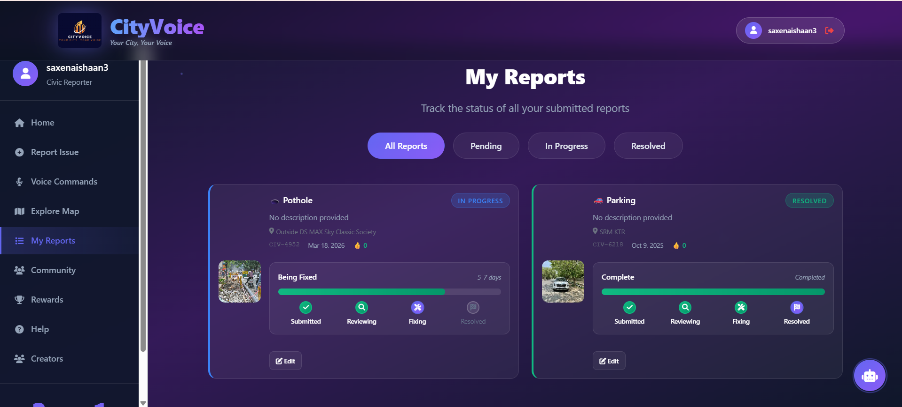
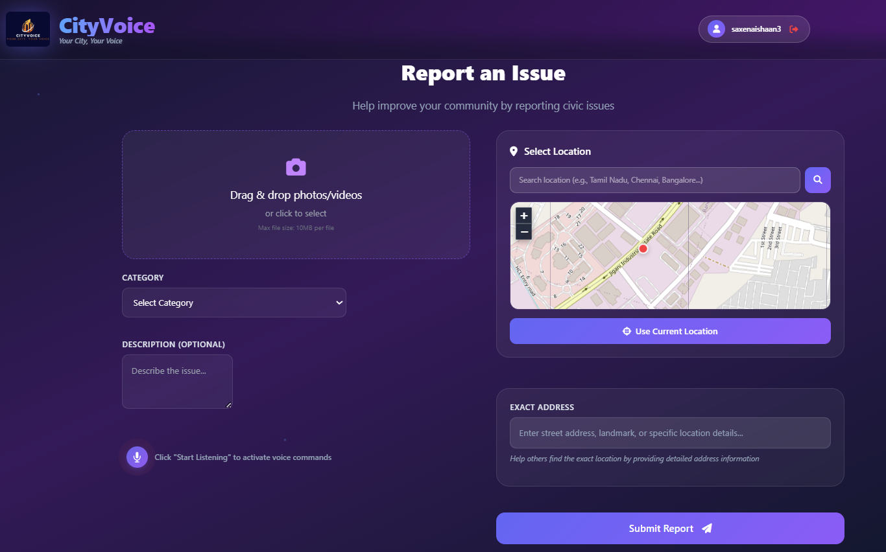
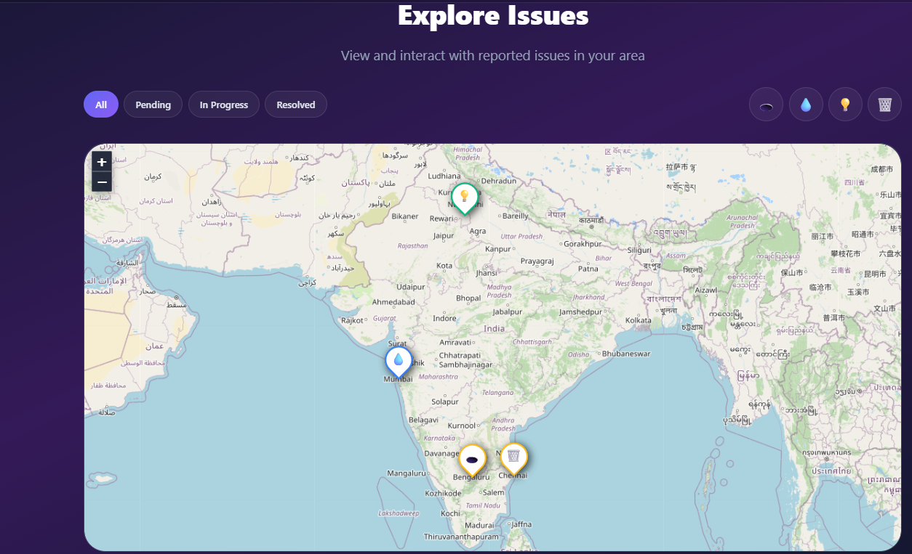
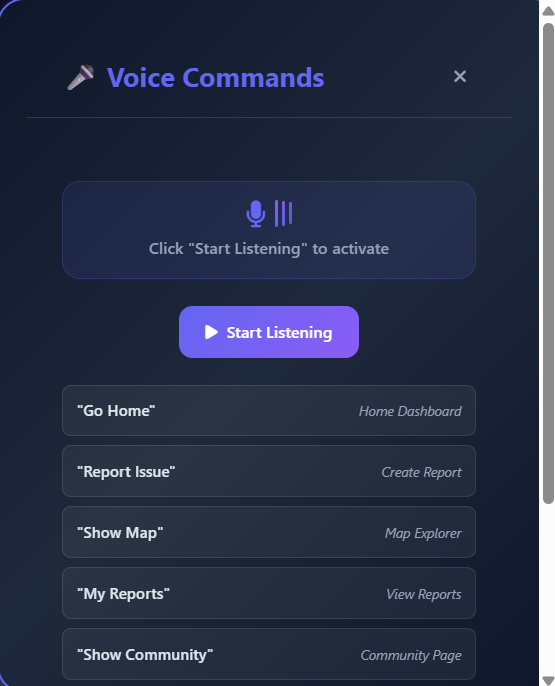

# CityVoice 🏙️


CityVoice is a civic-tech web platform that allows citizens to report local issues such as potholes, garbage, streetlight failures, and infrastructure problems directly through an interactive map.

The platform enables users to upload images, pinpoint locations, and track community reports to help improve urban infrastructure and civic responsiveness.

---

## 🚀 Live Demo

https://ishaansaxena2005.github.io/CityVoice/

---

## 📸 Screenshots

### Homepage



### Report Issue



### Interactive Map



### Voice Commands



---

## ✨ Features

- 📍 **Location-based issue reporting**
- 🗺 **Interactive map using OpenStreetMap**
- 📸 **Upload images/videos with reports**
- 👤 **User authentication with JWT**
- 👍 **Upvote system for community validation**
- 📊 **Real-time statistics and analytics**
- 📂 **Backend API for report management**
- 📱 **Responsive UI for desktop and mobile**

---

## 🛠 Tech Stack

Frontend

- HTML5
- CSS3
- JavaScript

Backend

- Node.js
- Express.js
- JWT Authentication

APIs & Tools

- OpenStreetMap
- Geolocation API
- REST APIs

---

## 🧠 Skills Demonstrated

- Full-stack web development
- REST API development
- Authentication using JWT
- File upload handling
- Geolocation and mapping
- Civic-tech problem solving

---

## ⚙️ Run Locally

### 1️⃣ Clone the repository

```
git clone https://github.com/IshaanSaxena2005/CityVoice.git
```

### 2️⃣ Install backend dependencies

```
npm install
```

### 3️⃣ Create `.env` file

```
PORT=3000
JWT_SECRET=your_secret_key
```

### 4️⃣ Start backend server

```
npm run dev
```

### 5️⃣ Start frontend server

```
python -m http.server 8000
```

Open in browser:

```
http://localhost:8000
```

---

## 🏆 Hackathon Project

CityVoice was developed as a **civic-tech solution** to empower citizens to report infrastructure issues and help authorities respond faster to local problems.

---

## 👨‍💻 Team

**Ishaan Saxena**  
Full-Stack Developer | System Architecture | Feature Integration

**Prashil Singh**  
Frontend Development | UI/UX Design

**Harpreet Singh**  
Concept Design | Innovation Strategy

**Rahil Rathod**  
Presentation & Documentation

---

⚠️ This project is built for **educational and demonstration purposes**.
